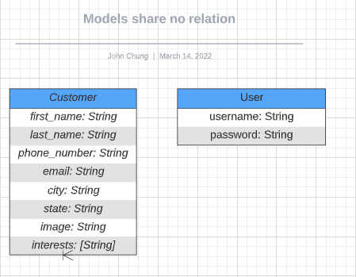

# <h1 align='center'>ExSalelent CRM</h1>

This is a CRM CRUD application that is built and catered towards car sales. The user will be able to create and store customer information for new prospects that are in the market for a vehicle. 

## Technologies Used

<li>Node.js</li>
<li>Express</li>
<li>React</li>
<li>MongoDB</li>
<li>JavaScript</li>
<li>CSS</li>
<li>HTML</li>

## ERD

## Heroku Link

